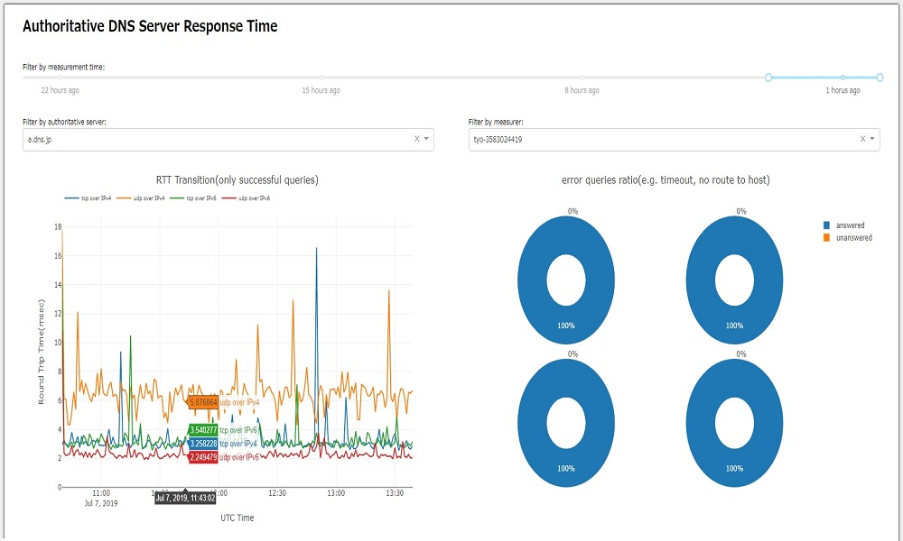

# dnsprobe; RTT monitor

[https://dnssl.mtcq.jp/](https://dnssl.mtcq.jp/)




## Abstract

This system is a RTT monitor for authoritative DNS Server.
Multiple probes deployed around the world like RIPE Atlas is measuring target authoritative DNS servers.
(But currently we have only one probe...)


## Installation

#### Prerequirements

* Python3.7(pipenv)
* InfluxDB1.7.6(for manager)
* MariaDB10.0.38(for manager)
* Probes must have IPv4/v6 address(for measurer)

#### Make environment using pipenv

```
$ git clone https://github.com/moratori/dnsprobe.git
$ cd dnsprobe && pipenv install
```

