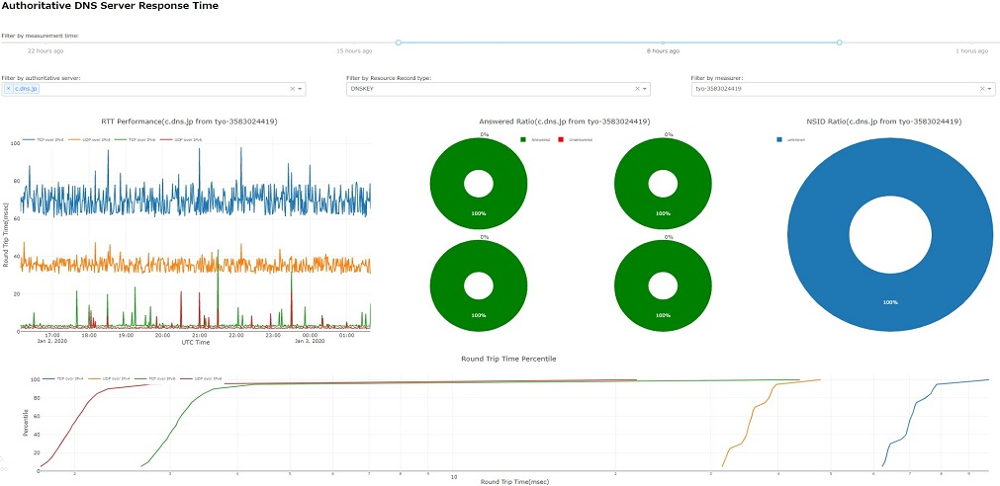

# dnsprobe; RTT monitor



## 概要

権威DNSサーバーのRTTを測定し表示するシステムです。

プローブが権威DNSサーバーに定期的に問い合わせを行い、RTTを測定します。


## インストール

#### 前提

* Python3.7系がインストールされていること
* pipenvがインストールされていること
* InfluxDB1.7.6がインストールされていること（Managerとして動かす場合）
* MariaDB10.0.38がインスートされていること（Managerとして動かす場合）
* IPv4/v6グローバルアドレスがそれぞれ付与されていること（Measurerとして動かす場合）

#### Managerとして動かす場合

* 実行環境を`pipenv`で構築する。

  ```
  $ git clone https://github.com/moratori/dnsprobe.git
  $ cd dnsprobe && pipenv install
  ```

* アプリコンフィグは下記のようにconfディレクト配下に`.ini`ファイルを作る

  ```
  $ cat conf/general.ini
  [logging]
  ### one of the following: CRITICAL, ERROR, WARNING, INFO, DEBUG
  loglevel = DEBUG
  ### one of the following: S(econd), M(inutes), H(our), D(ay)
  rotation_timing = D
  ### log backup file counts
  backupcount = 120
  
  # MariaDB
  [database]
  host = host
  user = dnsprobe
  passwd = passwd
  dbname = dnsprobe
  
  # InfluxDB
  [data_store]
  host = host
  port = 8086
  user = user
  passwd = passwd
  database = dnsprobe
  
  $ cat conf/main_create_measurement_target.ini
  [data]
  path = data/measurement_info.json
  
  $ cat conf/main_viewer.ini
  [resource]
  css_dir = css/viewer/
  ```

* DBスキーマの作成

  ```
  $ ./bin/run_main_initialize_database.sh
  ```

* 測定対象の権威DNSサーバー自体のアドレスを解決して保存する

  ```
  $ mkdir -p static/data
  $ ./bin/run_main_create_measurement_target.sh 8.8.8.8 1.1.1.1
  ```

* `controller`と`viewer`を起動する

  ```
  $ ./bin/run_main_mesurer_controller-wsgi.sh
  $ ./bin/run_main_viewer-wsgi.sh
  ```

  `uWSGI`サーバーとして起動できる様、あらかじめ`Nginx`などに設定をしておく

  ```
  server {
          ...
          location / {
                  try_files $uri @wsgiapp;
          }
          location @wsgiapp {
                  include uwsgi_params;
                  uwsgi_pass unix:/tmp/dnsprobe_viewer.sock;
          }
          ...
  }
  ```

#### Measurerとして動かす場合

(TBD)


