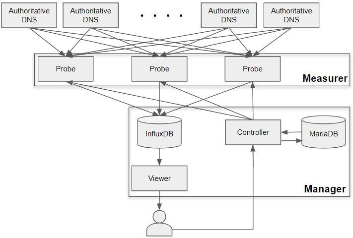

# dnsprobe; RTT monitor


## 概要

権威DNSサーバーのRTTを測定し表示するシステムです。

プローブが権威DNSサーバーに定期的に問い合わせを行い、RTTを測定します。




## インストール

#### 前提

* Python3.7系がインストールされていること
* pipenvがインストールされていること
* InfluxDB1.7.6がインストールされていること（Managerとして動かす場合）
* MariaDB10.0.38がインスートされていること（Managerとして動かす場合）
* IPv4/v6グローバルアドレスがそれぞれ付与されていること（Measurerとして動かす場合）

#### 実行環境をpipenvで構築する。

```
$ git clone https://github.com/moratori/dnsprobe.git
$ cd dnsprobe && pipenv install
```


#### Managerとして動かす場合

(TBD)


#### Measurerとして動かす場合

(TBD)
